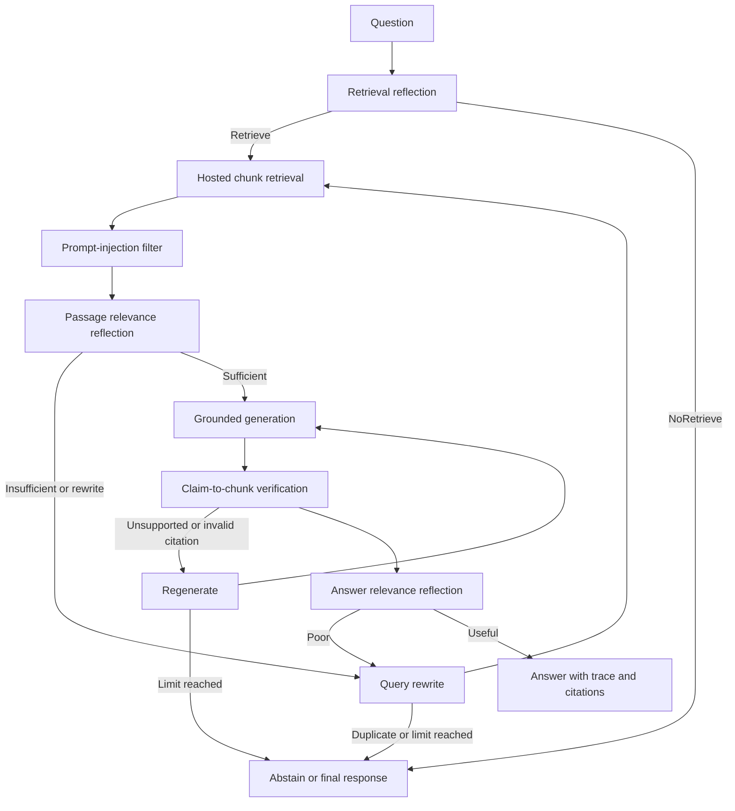

# Self-RAG-Inspired Research Assistant

This repository implements a graph-backed, Self-RAG-inspired document research assistant. It uses explicit retrieval reflection, passage relevance grading, query rewriting, grounded generation, claim verification, bounded regeneration, and abstention.

**Important:** this is not a real pretrained or fine-tuned Self-RAG model. It does not load a Self-RAG checkpoint or reproduce the original model's learned reflection tokens. The reflection protocol is implemented with structured Pydantic outputs around a Groq model. Calling this project a real end-to-end Self-RAG model would be inaccurate unless a pretrained or fine-tuned Self-RAG model is added.

## Architecture



## Safety and correctness behavior

- Reflection cannot silently fall back to a fabricated score. Missing credentials, model errors, or invalid structured output become explicit workflow failures and abstentions.
- Retrieved text is treated as untrusted data. Instruction-like passages are filtered and recorded in the reflection trace.
- Each indexed chunk receives a stable `source_id`. Supported claims must cite retrieved chunk IDs; citations to unseen chunks invalidate the answer.
- Unsupported claims trigger a bounded regeneration attempt. The workflow abstains when generation or retrieval limits are reached.
- Query rewrites are tracked and duplicate queries terminate the loop.
- Retrieval and generation have separate attempt budgets. The API currently uses two retrieval attempts and two generation attempts per question.
- The API returns retrieval decisions, passage grades, claim verification, attempts, injection flags, abstention reasons, and the complete reflection trace.
- An abstention is returned as a structured successful response with `status: "Abstain"`, `verification_status: "abstained"`, a user-safe answer, and `abstain_reason`; it is not represented as a fabricated answer or confidence score.
- Only non-abstained answers are persisted in Recent sessions. Failed or evidence-free requests remain visible in the current response but do not create misleading session entries.

## API response

`POST /api/answer` accepts multipart form data containing `question`, `model`, optional `session_id`, conversation `history`, source metadata, URLs, and uploaded files. Its response includes:

- `answer`, `citations`, `sources`, and retrieved `evidence`;
- `retrieval_decision` and `passage_relevance_results`;
- `answer_support_verification`, `unsupported_claims`, and `verification_status`;
- `reflection_trace`, `retrieval_attempts`, and `generation_attempts`;
- `status`, `confidence`, `abstain_reason`, `reflection_failure`, and `prompt_injection_detected`.

The frontend renders the answer together with its citations, verification/abstention state, and expandable reflection trace.

## Run locally

Create a virtual environment and install dependencies:

```bash
python -m venv .venv
.venv\\Scripts\\activate
pip install -r requirements.txt
```

The default requirements are serverless-safe. Retrieval and session persistence use Supabase tables through its REST API; no local SQLite database or Chroma directory is used by the production path.

```bash
pip install -r requirements-full.txt
```

The full profile is optional for local experimentation only. It is not required by the Vercel API deployment.

Create `.env` with a Groq key and optional model settings:

```env
GROQ_API_KEY=your_key_here
GROQ_MODEL=openai/gpt-oss-20b
MAX_RETRIES=3
SUPABASE_URL=https://your-project.supabase.co
SUPABASE_SERVICE_ROLE_KEY=your_server_only_service_role_key
CORS_ORIGINS=https://your-frontend.vercel.app
```

Run [supabase/schema.sql](supabase/schema.sql) in the Supabase SQL editor before using document upload or session history. Keep `SUPABASE_SERVICE_ROLE_KEY` server-side; never expose it as a frontend variable.

Start the API:

```bash
uvicorn api:app --reload
```

Deployment platforms that expect `app.py` can use the equivalent target:

```bash
uvicorn app:app --host 0.0.0.0 --port 8000
```

Start the React frontend in another terminal:

```bash
cd frontend
npm install
npm run dev
```

For local development, the API is served on `http://127.0.0.1:8000` and the frontend on the Vite URL shown in the terminal. Production frontend builds must set `VITE_API_URL`; they do not fall back to localhost.
The legacy Streamlit interface is isolated in `streamlit_app.py` and is not part of the Vercel deployment.

## Serverless deployment

The repository includes `.vercelignore` to keep local environments, caches, indexes, databases, and Git metadata out of serverless function bundles. The API uses only environment-based Supabase persistence and Groq credentials. There is no production dependency on local SQLite or Chroma storage.

For a serverless deployment, configure the Python entry point as `app:app` and provide `GROQ_API_KEY`, `SUPABASE_URL`, `SUPABASE_SERVICE_ROLE_KEY`, and `CORS_ORIGINS` through the platform's environment settings. Deploy the `frontend` directory separately as a Vercel static Vite project with `VITE_API_URL` pointing at the API deployment.

## Evaluation

`evaluation/evaluate.py` evaluates labeled examples rather than returning fixed demonstration scores. Each example can provide expected source IDs, expected answer terms, expected rewrite behavior, expected abstention behavior, retrieved IDs, citations, and unsupported claims. Use `EvaluationMetrics.evaluate_dataset()` with a labeled dataset to obtain aggregate retrieval precision/recall, citation precision/recall, answer-term recall, correction success, abstention correctness, and end-to-end metrics.

## Tests

```bash
python -m pytest -q
```

The test suite covers API validation and persistence, graph construction, structured reflection contracts, explicit reflection failure, passage/citation behavior, duplicate-query termination, bounded retries, and labeled evaluation helpers. Model-backed behavioral tests mock the workflow/reflection boundary so they remain deterministic and do not require a live Groq request.

The current validation result is 14 backend tests passing. The React frontend also passes its production TypeScript/Vite build.

## Repository layout

```text
api.py                 FastAPI implementation and workflow response mapping
app.py                 FastAPI deployment entry point
streamlit_app.py       Optional legacy Streamlit interface
storage.py             Supabase REST session and document-chunk adapters
supabase/schema.sql    Hosted persistence schema
vercel.json            Python API deployment manifest
graph/                 LangGraph state, routing, and nodes
models/                Structured reflection schemas and Groq runner
rag/                   Loaders, chunk IDs, vector store, and retriever
evaluation/            Label-driven evaluation
tests/                 Regression and behavioral tests
frontend/              React + TypeScript research UI
```

## Known limitations

- Reflection and generation require a compatible Groq model and a valid API key.
- This is a structured orchestration implementation, not a pretrained Self-RAG checkpoint.
- Retrieval uses hosted Supabase document chunks with deterministic lexical ranking; a hosted vector database can replace this adapter without changing the Self-RAG workflow.
- Supabase availability and network latency affect sessions and retrieval.
- Authentication is currently a lightweight local session identity, not production user authentication.
